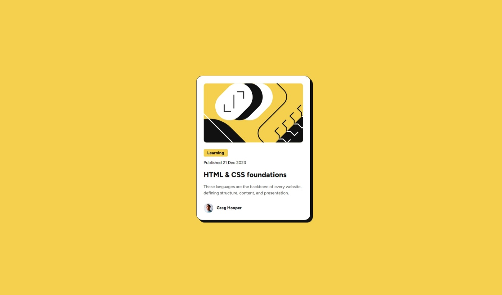

# Frontend Mentor - Blog Preview Card Solution

This is a solution to the [Blog Preview Card challenge on Frontend Mentor](https://www.frontendmentor.io/challenges/blog-preview-card-ckPaj01IcS). Frontend Mentor challenges help you improve your coding skills by building realistic projects.

## Table of Contents

- [Overview](#overview)
  - [The Challenge](#the-challenge)
  - [Screenshot](#screenshot)
  - [Links](#links)
- [My Process](#my-process)
  - [Built With](#built-with)
  - [What I Learned](#what-i-learned)
  - [Continued Development](#continued-development)
  - [Useful Resources](#useful-resources)
- [Author](#author)
- [Acknowledgments](#acknowledgments)

---

## Overview

### The Challenge

Users should be able to:

- See hover and focus states for all interactive elements on the page.

### Screenshot



---

### Links

- **Solution URL:** [https://github.com/ivanpehar/blog-preview-card](https://github.com/ivanpehar/blog_preview_card)
- **Live Site URL:** [https://ivanpehar.github.io/blog-preview-card/](https://ivanpehar.github.io/blog_preview_card/)

---

## My Process

### Built With

- Semantic HTML5 markup
- CSS custom properties
- Flexbox

---

### What I Learned

During this project, I improved my understanding of **Flexbox** for layout structuring and how to use `object-fit` to maintain image aspect ratio while applying `border-radius`.  
One interesting thing I learned was how to **apply hover effects** dynamically:

```css
.blog-title:hover {
  color: #f4d04e; /* Changes text to yellow on hover */
  transition: color 0.3s ease;
}

### Continued development

For future projects, I plan to:

- Explore more complex layouts using **CSS Grid**.

### Useful resources

- [MDN Web Docs - Object Fit](https://developer.mozilla.org/en-US/docs/Web/CSS/object-fit) - Helped me fix the image border-radius issue.
- [CSS Tricks - Flexbox Guide](https://css-tricks.com/snippets/css/a-guide-to-flexbox/) - A great reference while positioning elements.

## Author

- **GitHub** - [ivanpehar](https://github.com/ivanpehar)
- **Frontend Mentor** - [@ivanpehar](https://www.frontendmentor.io/profile/ivanpehar)